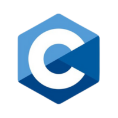
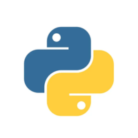
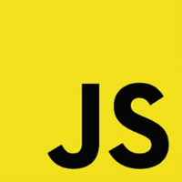
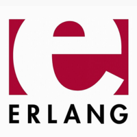
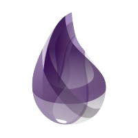
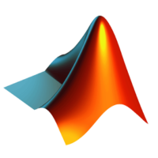
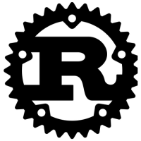
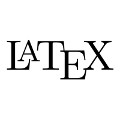

# Hi, I'm Trushant Adeshara 👋 

Welcome to my profile! I'm a robotics graduate student at the University of Michigan. I am currently research in the domain of multi-robot / multi-agent systems, parallel computing, deep learning and additive manufacturing. Thanks for visiting and let's [connect](https://www.linkedin.com/in/trushant-adeshara/)!

 

## Programming Languages

<code></code>
<code></code>
<code></code>
<code></code>
<code></code>
<code></code>
<code></code>
<code></code>
<code></code>

<!--
**trushant05/trushant05** is a ✨ _special_ ✨ repository because its `README.md` (this file) appears on your GitHub profile.

Here are some ideas to get you started:

- 🔭 I’m currently working on ...
- 🌱 I’m currently learning ...
- 👯 I’m looking to collaborate on ...
- 🤔 I’m looking for help with ...
- 💬 Ask me about ...
- 📫 How to reach me: ...
- 😄 Pronouns: ...
- ⚡ Fun fact: ...
-->
