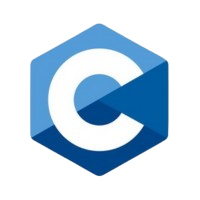

# Hi, I'm Trushant Adeshara 👋 

Welcome to my profile! I hold an M.S. in Robotics from the University of Michigan. My work spans multi-robot systems, robotics software architecture, digital twin development, deep learning, sim2real ↔ real2sim pipelines, and parallel computing. Thanks for visiting—feel free to check out my [portfolio](https://trushant-adeshara.com/) !

 

### Programming Languages & Tools
<code></code>
<code></code>
<code></code>
<code></code>
<code></code>
<code></code>
<code></code>
<code></code>
<code></code>
<!--<code></code>-->

<!--<code></code>-->
<!--<code></code>-->
<!--<code></code>-->
<!--<code></code>-->

### Robotics Framework & Simulators
<code></code>
<code></code>
<code></code>
<code></code>
<code></code>
<code></code>
<code></code>
<!--<code></code>
<code></code>
<code></code>
<code></code>
<code></code>
<code></code>-->

### Libraries & SDKs
<code></code>
<code></code>
<code></code>
<code></code>
<code></code>

 

## Research & Projects
<table cellspacing="5" cellpadding="5" width="100%">
  <tr>
    <td align="center">
      <a href="https://trushant05.github.io/isaacflow/">
         IsaacFlow
      </a>
    </td>
    <td align="center">
      <a href="https://typescriptlang.org">
         Roboracer
      </a>
    </td>
    <td align="center">
      <a href="https://trushant05.github.io/pallet_insight_ros2/">
         Pallet Insight
      </a>
    </td>
  </tr>
  <tr>
    <td align="center">
      <a href="https://github.com/trushant05/speech2mesh">
         Speech2Mesh
      </a>
    </td>
    <td align="center">
      <a href="https://github.com/trushant05/botlab_f23">
         Botlab
      </a>
    </td>
    <td align="center">
      <a href="https://github.com/trushant05/armlab_f23">
         Armlab
      </a>
    </td>
  </tr>
  <tr>
    <td align="center">
      <a href="https://trushant05.github.io/cl3dp/">
         Close Loop in 3D Printing
      </a>
    </td>
    <td align="center">
      <a href="https://aws.amazon.com/sqs">
         Edge Cluster
      </a>
    </td>
    <td align="center">
      <a href="https://github.com/trushant05/eyantra_2019">
         eYantra Robotics Competition 2019
      </a>
    </td>
  </tr>
</table>

 

## References

Here are some amazing GitHub profile READMEs that inspired me:
1. [JessicaLim8](https://github.com/JessicaLim8/JessicaLim8/blob/master/README.md)
2. [anuraghazra](https://github.com/anuraghazra)
